<p align="center">
  
</p>

<p align="center">
  <a href="https://twitter.com/Habeeb_hustle"></a>
  
  
</p>

### ⚡ About me

```php
<?php

$me = [
    'name'      => 'Kazeem Habeeb',
    'focus'     => ['Web Development', 'Software Development'],
    'learning'  => 'PHP',
    'lookingFor'=> 'PHP projects to collaborate on',
    'reachMe'   => 'https://twitter.com/Habeeb_hustle',
];

echo "Let's build something cool together 🚀";
```

### 📊 Stats

<p align="center">
  
</p>

### 🛠️ Recently working on

<!-- PROJECTS:START -->
_Nothing public yet. Something's cooking._
<!-- PROJECTS:END -->

### 🐍 Contributions

<picture>
  <source media="(prefers-color-scheme: dark)" srcset="https://raw.githubusercontent.com/kazeemhabeeb/kazeemhabeeb/output/snake-dark.svg"/>
  
</picture>

<sub>Stats and projects above are regenerated daily by a <a href="scripts/generate.php">small PHP script</a> running in GitHub Actions.</sub>
